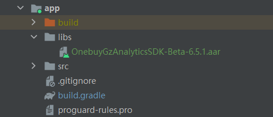
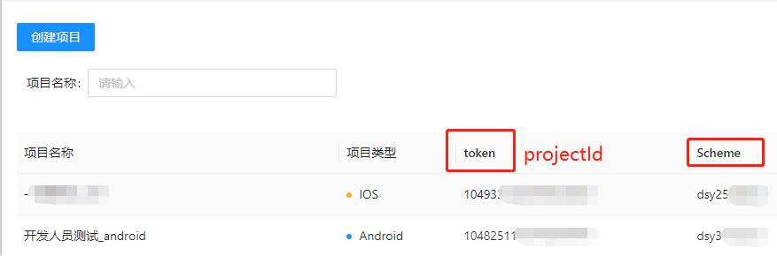

## Android可视化埋点SDK

最后更新时间: 2022年12月06日

### 通过Gradle集成aar 包

- **离线aar包集成**

将 SDK 的 aar 包复制到工程的 libs 目录下，如果有老版本 aar 包在其中，请删除。

 

- **添加SDK依赖， dependencies 配置方式如下：**

```java
implementation files('libs/OnebuyGzAnalyticsSDK-Beta-6.5.1.aar')
```

- **获取 projectId 和 Scheme，登录Web可视化平台创建项目可获取**

 

- **在app的 AndroidManifest 中添加 scheme**

```java
<activity android:name="com.sensorsdata.analytics.android.sdk.dialog.SchemeActivity"
    android:configChanges="orientation|screenSize"
    android:exported="true"
    android:launchMode="singleTask">
   	<intent-filter>
        <action android:name="android.intent.action.VIEW" />
        <category android:name="android.intent.category.BROWSABLE" />
        <category android:name="android.intent.category.DEFAULT" />
     	<data android:scheme="Web平台创建项目生成Scheme" />
  	</intent-filter>
</activity>
```

### 初始化SDK

在 **Application** 的 ***onCreate()*** 方法中**同步**调用 ***SensorsDataAPI.startWithConfigOptions()*** 初始化 SDK

（推荐使用以下默认配置）

```java
String SERVER_URL = "数据接收地址";
SAConfigOptions configOptions = new SAConfigOptions(SERVER_URL);
        configOptions
                .setProjectId("Web平台创建项目生成token")
                .setAutoTrackEventType(
                SensorsAnalyticsAutoTrackEventType.APP_VIEW_SCREEN |
                SensorsAnalyticsAutoTrackEventType.APP_CLICK);
        configOptions.enableLog(true);//开启 Log
        configOptions.enableVisualizedAutoTrack(true);// 开启可视化全埋点
        SensorsDataAPI.startWithConfigOptions(this, configOptions);// 需要在主线程初始化SDK
        SensorsDataAPI.sharedInstance(this).trackFragmentAppViewScreen();// Fragment页面事件的采集
```

### Fragment复用问题
如果项目中存在Fragment复用，必须让所有已复用的Fragment实现**ScreenAutoTracker**接口，并重写方法getTrackProperties()和rootViewOfFragment()，否则相应界面的事件统计结果会存在较大误差。其中，getTrackProperties()方法返回一个JSONObject对象，该对象内置了2个key：<br><br>**浏览事件页面路径：DsyConstants.NESTED_FRAGMENT_SCREEN_NAME**
<br><br>**点击事件页面路径：AopConstants.SCREEN_NAME**
<br><br>**页面路径建议采用如下格式（各级路径以“|”分隔）：**<br>
Activity带包名路径|外层Fragment带包名路径|复用的当前Fragment带包名路径[Fragment实例唯一标识]
</br>
#### 场景一、通过viewpage等组件加载Fragment的多个实例时，那么每个实例需要自定义:</br>
**1、不同的 DsyConstants.NESTED_FRAGMENT_SCREEN_NAME 确保浏览事件页面路径不同；**
<br> <br>
**2、不同的 AopConstants.SCREEN_NAME 确保点击事件页面路径不同；**
<br><br>
如下面示例，某个Activity通过Viewpage复用了FitUpFragment的多个实例，其中的pageType应该是你定义的每个FitUpFragment实例的唯一标识：<br>

    @Override
    public JSONObject getTrackProperties() throws JSONException {
        String mAnalyticsSdkScreenName = String.format(TimeUtils.SDK_LOCALE, "%s|%s",
                getActivity().getClass().getCanonicalName(),
                getClass().getCanonicalName() + "[" + pageType + "]");
        JSONObject jsonObject=new JSONObject();
        jsonObject.put(AopConstants.SCREEN_NAME, mAnalyticsSdkScreenName);
        jsonObject.put(DsyConstants.NESTED_FRAGMENT_SCREEN_NAME, mAnalyticsSdkScreenName);
        return jsonObject;
    }

    @Override
    public View rootViewOfFragment() {
        return getView();
    }
<br><br>
#### 场景二、同一界面内同时加载多个Fragment，无论是嵌套还是在同一层级上，当前界面内的所有Fragment需要自定义：<br>
**1、相同的 DsyConstants.NESTED_FRAGMENT_SCREEN_NAME确保浏览事件页面路径唯一；**
<br><br>
**2、不同的 AopConstants.SCREEN_NAME确保点击事件页面路径不同；**
<br><br>
如下面示例，某个界面同时显示了多个Fragment，其中的position是该Fragment不同实例的唯一标识：<br><br>

    override fun getTrackProperties(): JSONObject {
        val jsonObject=JSONObject()
        val screenName = String.format(
            TimeUtils.SDK_LOCALE, "%s|%s",
            analyticsSdkScreenName,javaClass.canonicalName + "[" + position+"]"
        )
        jsonObject.put(AopConstants.SCREEN_NAME, screenName)
        jsonObject.put(DsyConstants.NESTED_FRAGMENT_SCREEN_NAME, analyticsSdkScreenName)
        return jsonObject
    }

    override fun rootViewOfFragment(): View {
        return requireView()
    }

<br>
示例中，由于被复用的Fragment是嵌套在另一个Fragment内使用的，所以其AopConstants.SCREEN_NAME需要在前面拼接上Activity和外层Fragment的带包名路径analyticsSdkScreenName进行约束。

#### Fragment复用架构示例图

如图，某个Activity通过Viewpage加载了两个FragmentA和一个FragmentC以显示3个不同的界面：首页、服务、我的。<br><br>
**在可视化圈选阶段，为了分别统计“首页”界面和“服务界面”的页面浏览事件，需要:**<br><br>
1、FragmentA的每个实例自定义不同的DsyConstants.NESTED_FRAGMENT_SCREEN_NAME：<br><br>
“首页”FragmentA的DsyConstants.NESTED_FRAGMENT_SCREEN_NAME可以为：<br>
Activity包名路径|FragmentA的包名路径[0]<br><br>
"服务"FragmentA的DsyConstants.NESTED_FRAGMENT_SCREEN_NAME可以为：<br>
Activity包名路径|FragmentA的包名路径[1]<br><br>
2、在同一个界面内，由于FragmentA和FragmentC都内嵌了两个FragmentB，内嵌FragmentB的实例的DsyConstants.NESTED_FRAGMENT_SCREEN_NAME需要和外层FragmentA、FragmentC的保持一致，即:<br><br>
“首页”界面内 **所有Fragment** 的DsyConstants.NESTED_FRAGMENT_SCREEN_NAME应该为：<br>
Activity包名路径|FragmentA的包名路径[0]<br><br>
“服务”界面内 **所有Fragment** 的DsyConstants.NESTED_FRAGMENT_SCREEN_NAME应该为：<br>
Activity包名路径|FragmentA的包名路径[1]<br><br>
"我的"界面内 **所有Fragment** 的DsyConstants.NESTED_FRAGMENT_SCREEN_NAME应该为：<br>
Activity包名路径|FragmentC的包名路径

**针对点击事件的页面路径AopConstants.SCREEN_NAME，每个Fragment的定义从外到内需要具体到当前Fragment的页面路径，即**<br><br>
“首页”界面：<br><br>
FragmentA的AopConstants.SCREEN_NAME可以为：<br>
Activity包名路径|FragmentA的包名路径[0]<br><br>
第一个FragmentB的AopConstants.SCREEN_NAME可以为：<br>
Activity包名路径|FragmentA的包名路径[0]|FragmentB的包名路径[0]<br><br>
第二个FragmentB的AopConstants.SCREEN_NAME可以为：<br>
Activity包名路径|FragmentA的包名路径[0]|FragmentB的包名路径[1]

其他界面按上述逻辑依次定义即可，不再赘述。